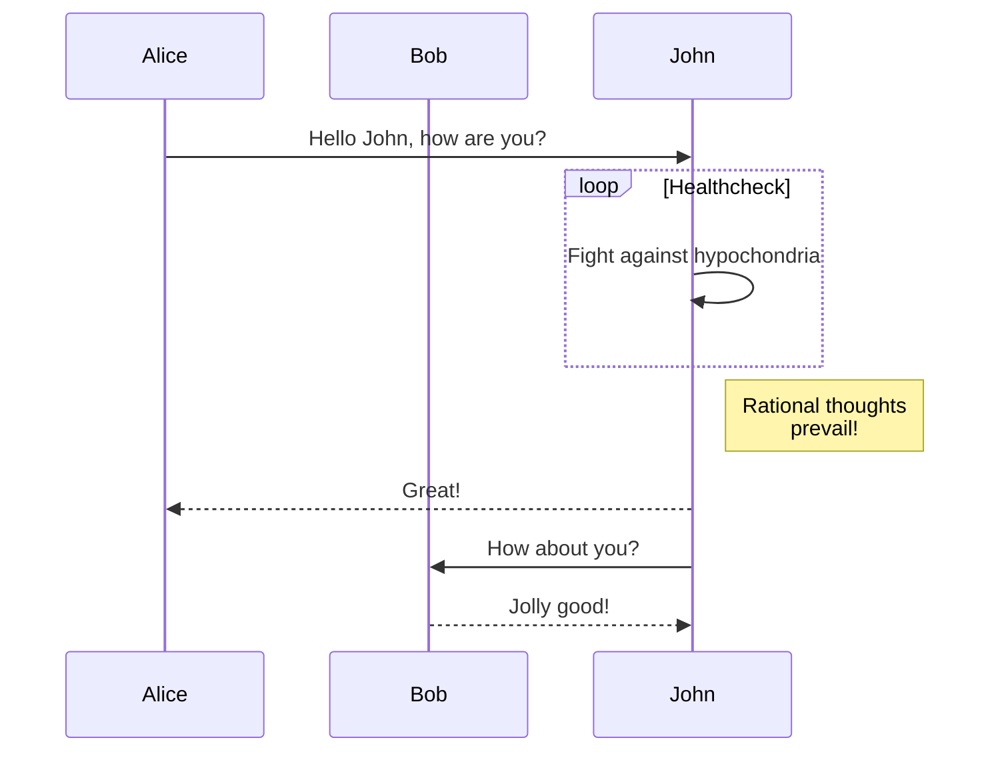

Hiện tại giao diện hỗ trợ [Mermaid](#mermaid) để vẽ sơ đồ.

<!--more-->

## Mermaid

[Mermaid](https://github.com/mermaid-js/mermaid#readme) là công cụ vẽ sơ đồ và biểu đồ dựa trên JavaScript, nhận định nghĩa dạng văn bản gợi ý Markdown và tạo sơ đồ động trên trình duyệt. Ví dụ Mermaid có thể vẽ sơ đồ luồng, sơ đồ tuần tự, biểu đồ tròn và nhiều hơn nữa.

Dùng Mermaid trong giao diện đơn giản chỉ cần viết một khối code với ngôn ngữ đặt là `mermaid`:

````markdown

````

sẽ được hiển thị thành:


Sơ đồ tuần tự:



Để biết thêm, xem [Tài liệu Mermaid](https://mermaid-js.github.io/mermaid/#/).
